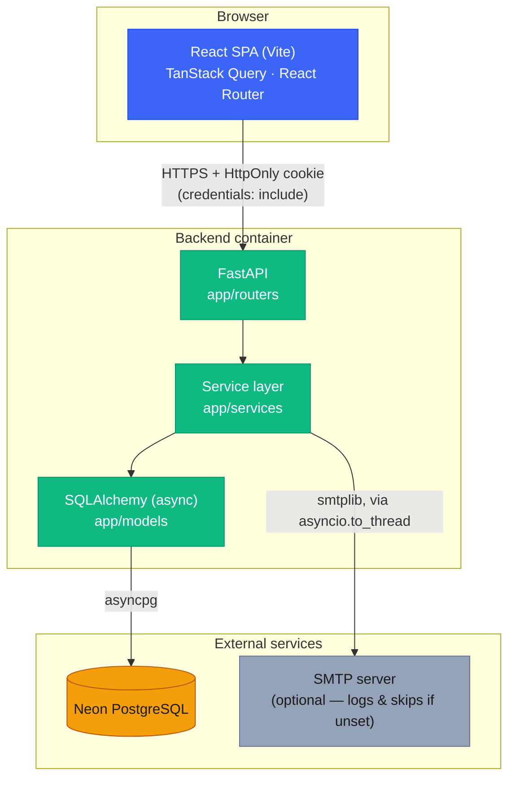
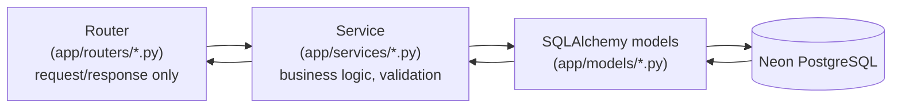
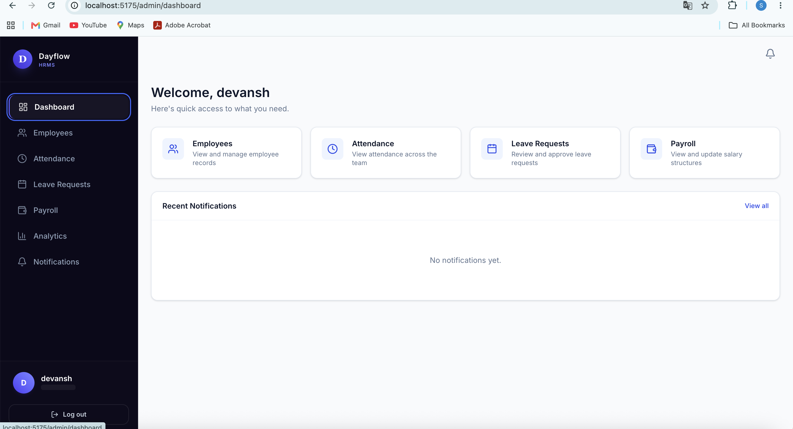
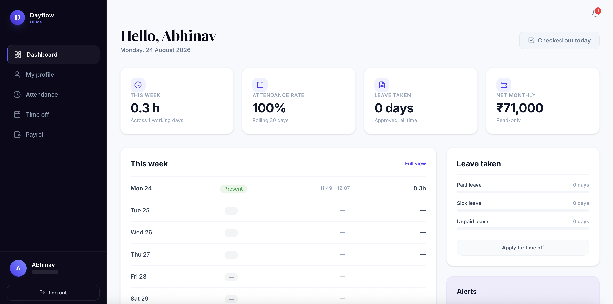

# Dayflow — HRMS

*Every workday, perfectly aligned.*

Dayflow is a full-stack Human Resource Management System: authentication,
employee profiles, attendance, leave management and approval, payroll
visibility, in-app + email notifications, and analytics — for both
employees and HR/Admin.

- **Backend**: [`backend/`](backend/README.md) — FastAPI + SQLAlchemy (async) + PostgreSQL (Neon)
- **Frontend**: [`frontend/`](frontend/README.md) — React + Vite + TypeScript + Tailwind

This file is the project-level overview. Each folder's own README has the
full setup/API/testing details for that layer.

## Contents

- [System architecture](#system-architecture)
- [Request flow](#request-flow)
- [Features](#features)
- [Tech stack](#tech-stack)
- [Screenshots](#screenshots)
- [Quick start](#quick-start)
- [Repository structure](#repository-structure)

## System architecture



Both services also run together via the root [`docker-compose.yml`](docker-compose.yml)
for local development — no database container, since both connect straight
to the same Neon Postgres instance.

## Request flow

Every backend request follows the same thin-router → service → ORM path;
business logic never lives in a route handler.



Auth is HttpOnly-cookie based: `POST /api/auth/login` sets `access_token`
as an `HttpOnly` cookie; the browser sends it automatically on every
subsequent request; `get_current_user` reads it server-side. The frontend
never reads or stores the token itself — see
[`backend/README.md`](backend/README.md#authentication--httponly-cookie).

```mermaid
sequenceDiagram
    participant Browser
    participant API as FastAPI
    participant DB as Neon Postgres

    Browser->>API: POST /api/auth/login {email, password}
    API->>DB: verify credentials
    DB-->>API: user row
    API-->>Browser: Set-Cookie: access_token=<jwt>; HttpOnly<br/>body: user only, no token
    Note over Browser: Cookie stored, sent automatically from here on

    Browser->>API: GET /api/employees/me (cookie sent automatically)
    API->>API: get_current_user() reads cookie, verifies JWT
    API->>DB: fetch employee
    DB-->>API: employee row
    API-->>Browser: employee JSON
```

## Features

- **Auth**: signup (EMPLOYEE/HR only — ADMIN is seed-only), login/logout via
  HttpOnly cookie, role-based access (`EMPLOYEE` / `HR` / `ADMIN`)
- **Employee profile**: self-service view/edit (phone, address, photo);
  HR/Admin manage full records (name, job title, department, status)
- **Attendance**: check-in/check-out, daily/weekly views, HR/Admin
  org-wide view with date filtering
- **Leave management**: apply, track status, HR/Admin approve/reject with
  a comment; overlap detection
- **Payroll**: HR/Admin sets the salary structure, employees get read-only
  visibility — no automatic calculation, by design
- **Notifications**: in-app + email on leave submit/approve/reject and
  payroll updates, unread badge, mark-as-read
- **Analytics**: attendance/leave/payroll summaries and trends, scoped to
  the employee for self-service, org-wide for HR/Admin

## Tech stack

| Layer | Stack |
|---|---|
| Frontend | React, Vite, TypeScript, Tailwind CSS, TanStack Query, React Router, Recharts |
| Backend | FastAPI, SQLAlchemy 2.x (async), Pydantic v2, Alembic |
| Database | PostgreSQL, hosted on [Neon](https://neon.tech) |
| Auth | JWT in an HttpOnly cookie, Argon2 password hashing |
| Email | stdlib `smtplib` (no extra dependency; skips gracefully if unconfigured) |
| Dev/deploy | Docker Compose (backend + frontend, no DB container) |

## Screenshots

**Admin dashboard**



More views (Employee dashboard, Time off, Payroll, Analytics) can be added
the same way — save an image into [`docs/screenshots/`](docs/screenshots/)
and reference it here:
```markdown

```

## Quick start

```bash
git clone <this repo>
cd Dayflow

cp backend/.env.example backend/.env    # fill in DATABASE_URL, TEST_DATABASE_URL, JWT_SECRET_KEY
cp frontend/.env.example frontend/.env  # VITE_API_URL=http://localhost:8000

docker compose up --build
```

- Frontend: http://localhost:5175
- Backend + Swagger docs: http://localhost:8000/docs

Seed dev accounts (1 ADMIN, 1 HR, 3 EMPLOYEE):
```bash
cd backend && source .venv/bin/activate && python -m scripts.seed
```

Full setup (Neon project creation, migrations, running tests, environment
variables) is documented in [`backend/README.md`](backend/README.md).

## Repository structure

```
Dayflow/
├── README.md              this file
├── docker-compose.yml      runs backend + frontend together for local dev
├── docs/
│   └── screenshots/         drop app screenshots here
├── backend/                 FastAPI + SQLAlchemy + Neon Postgres
│   └── README.md            full backend docs: setup, schema, API, testing
└── frontend/                React + Vite + TypeScript
    └── README.md
```
