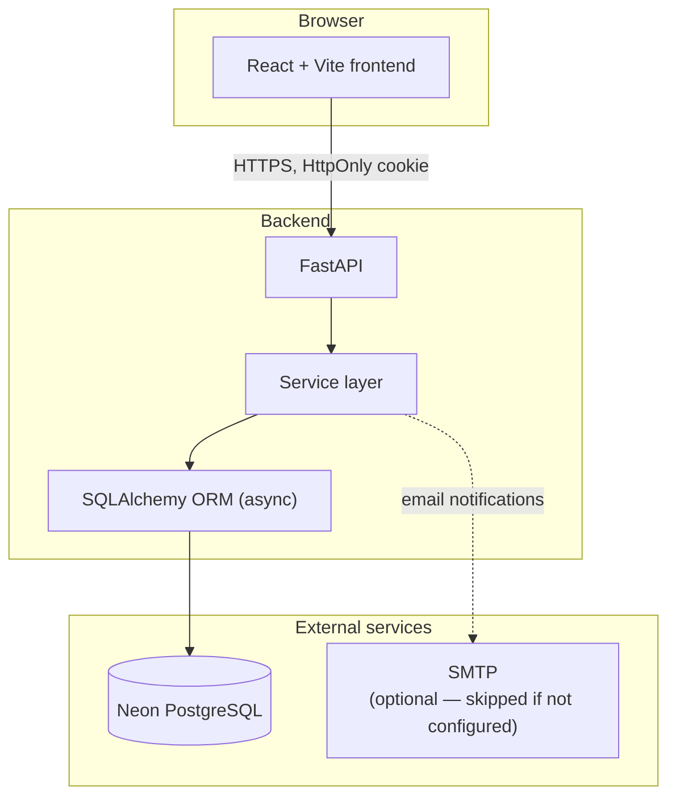
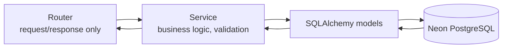
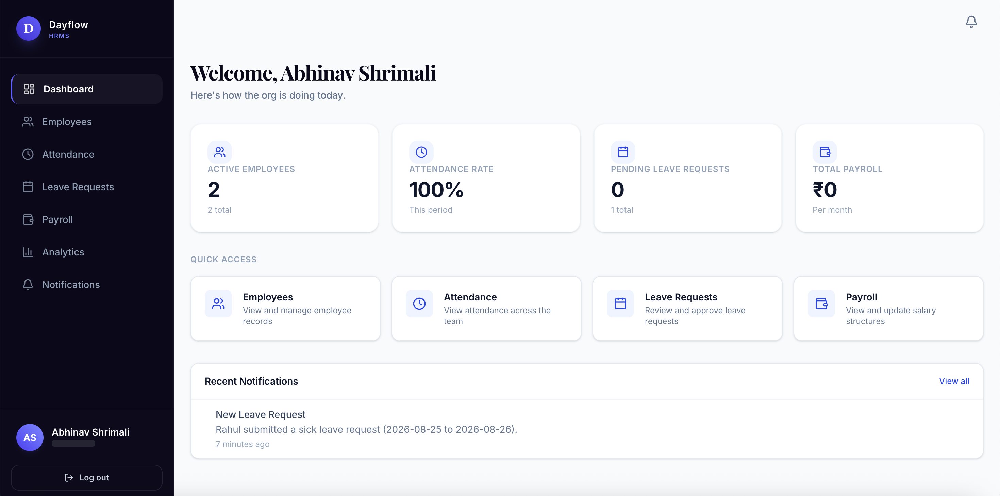

# Dayflow — HRMS

*Every workday, perfectly aligned.*

Dayflow is a full-stack Human Resource Management System covering
authentication, employee profiles, attendance, leave management and
approval, payroll visibility, in-app and email notifications, and
analytics — for both employees and HR/Admin users. The backend is a
FastAPI + SQLAlchemy (async) service on PostgreSQL (Neon); the frontend is
a React + Vite + TypeScript single-page app.

## Features

**Authentication**
- Signup (`EMPLOYEE` or `HR` role only — `ADMIN` accounts are seed-only,
  never self-registered) and login, both via an HttpOnly JWT cookie
- Signup signs the user in immediately — no separate email-verification
  step blocks access
- Logout clears the session cookie
- Email-based password reset with a short-lived reset link
- Basic rate limiting on login, signup, and forgot-password

**Employee profiles**
- Employees can view and edit their own contact details and upload a
  profile picture
- HR/Admin manage full employee records: name, job title, department,
  joining date, employment status
- Personalized employee dashboard and profile: a time-aware greeting with
  job title/department/joining date, a real "Work Journey" card (tenure
  and next work-anniversary, calculated from the actual joining date —
  never hard-coded), and an "About Me" summary built from real profile
  fields
- HR/Admin employee directory: search, plus filter by department, job
  title, and status, and sort by joining date

**Attendance**
- Employees check in/out and view their own daily and weekly history
- HR/Admin see attendance across the whole organization with date
  filtering

**Leave management**
- Employees apply for leave and track request status
- Overlapping leave requests are rejected automatically
- HR/Admin review, approve, or reject requests with an optional comment

**Payroll**
- HR/Admin set each employee's salary structure directly
- Employees get read-only visibility into their own payroll
- No automatic salary calculation — figures are entered, not derived

**Notifications**
- In-app and email notifications on leave submission/approval/rejection
  and payroll updates
- Unread count and mark-as-read/mark-all-read

**Analytics**
- Employees see their own attendance, leave, and payroll summaries with
  trends
- HR/Admin see the same data aggregated across the organization, plus
  employee/department statistics

**Role-based access**
- Every endpoint's authorization is resolved from the authenticated
  user's role (`EMPLOYEE`, `HR`, `ADMIN`) as stored server-side — never
  from anything the client sends

## System architecture



The frontend and backend deploy as two independent services (see
[Deployment](#deployment)); locally, both run together via
[`docker-compose.yml`](docker-compose.yml).

## Request flow

Every backend request follows the same path — route handlers stay thin
(request/response only), and business logic lives entirely in the service
layer.



## Authentication

Authentication uses a JWT stored in an HttpOnly cookie — the frontend
never reads, stores, or transmits the token itself.

```mermaid
sequenceDiagram
    participant Browser
    participant API as FastAPI
    participant DB as Neon Postgres

    Browser->>API: POST /api/auth/login (or /signup) — credentials
    API->>DB: verify credentials / create account
    DB-->>API: user record
    API->>API: generate JWT
    API-->>Browser: Set-Cookie: access_token=<jwt>; HttpOnly<br/>body: user only, never the token
    Note over Browser: Cookie stored, sent automatically on every request from here on

    Browser->>API: GET /api/employees/me (cookie sent automatically)
    API->>API: read cookie, verify JWT, resolve current user
    API->>DB: fetch data
    DB-->>API: result
    API-->>Browser: JSON response
```

- Signup and login both set the cookie — a new account is signed in
  immediately.
- Logout clears the cookie server-side.
- Forgot/reset password issues a short-lived, single-use token emailed to
  the account's registered address; the response is identical whether or
  not the email is registered, so the endpoint can't be used to enumerate
  accounts.
- CORS is configured with an explicit allow-list of origins and
  credentials enabled — never a wildcard origin with credentials.

## Role-based access

| Role | Can do |
|---|---|
| `EMPLOYEE` | Manage their own profile, check in/out, apply for leave and track it, view their own payroll (read-only), view their own analytics, manage their own notifications |
| `HR` | Everything an `EMPLOYEE` can, plus: view/manage all employee records, view organization-wide attendance, approve/reject leave requests, set payroll for any employee, view organization-wide analytics |
| `ADMIN` | Same operational permissions as `HR`. Created only via a local seed script — never through public signup |

Role is always read from the authenticated session server-side, never
trusted from request data.

## Tech stack

| Layer | Stack |
|---|---|
| Frontend | React, Vite, TypeScript, Tailwind CSS, TanStack Query, React Router, Recharts |
| Backend | FastAPI, SQLAlchemy 2.x (async), Pydantic v2, Alembic |
| Database | PostgreSQL, hosted on [Neon](https://neon.tech) |
| Auth | JWT in an HttpOnly cookie, Argon2 password hashing |
| Email | Python `smtplib` (skips gracefully if unconfigured) |
| Local dev | Docker Compose |
| Deployment | Vercel (frontend), Render (backend), Neon (database) |

## Screenshots

Screenshots use demo/placeholder data only.

**Login**


**HR dashboard**



**Employee dashboard**


Additional views (profile, attendance, leave management, payroll,
notifications, analytics) aren't captured yet. To add one, drop an image
into [`docs/screenshots/`](docs/screenshots/) and reference it here the
same way.

## Database schema

```
User
 └── Employee            1:1
      ├── Attendance
      ├── Leave
      ├── Payroll
      └── Notification
```

- **User** — authentication record: email, hashed password, role, active
  status, and password-reset token state. Holds no profile information.
- **Employee** — profile data linked 1:1 to a user: name, contact details,
  job title, department, joining date, profile picture. Identified
  everywhere by a human-readable employee code, not an internal ID.
- **Attendance** — one record per employee per day: check-in/check-out
  timestamps and a status (present/absent/half-day/leave).
- **Leave** — leave requests: type, date range, status, and the HR/Admin
  reviewer's decision and comment. Overlapping requests for the same
  employee are rejected at creation.
- **Payroll** — one record per employee: basic salary, allowances,
  deductions, gross and net salary. Entered directly by HR/Admin, not
  calculated.
- **Notification** — in-app notifications tied to a user (not just an
  employee, since HR/Admin also receive them), with a read/unread flag.

No credentials, connection strings, or real employee/salary data are
included in this repository.

## API overview

**Authentication**

| Method | Path | Purpose |
|---|---|---|
| POST | `/api/auth/signup` | Create an `EMPLOYEE`/`HR` account, signs in immediately |
| POST | `/api/auth/login` | Authenticate, sets the session cookie |
| GET | `/api/auth/me` | Current authenticated user |
| POST | `/api/auth/logout` | Clear the session cookie |
| POST | `/api/auth/forgot-password` | Request a password reset email |
| POST | `/api/auth/reset-password` | Complete a password reset with a token |

**Employees**

| Method | Path | Purpose |
|---|---|---|
| GET | `/api/employees/me` | Own profile |
| PATCH | `/api/employees/me` | Update own profile |
| PATCH | `/api/employees/me/profile-picture` | Upload a profile picture |
| GET | `/api/employees` | List all employees (HR/Admin) |
| GET | `/api/employees/{employee_id}` | Employee detail (HR/Admin) |
| PATCH | `/api/employees/{employee_id}` | Update an employee record (HR/Admin) |

**Attendance**

| Method | Path | Purpose |
|---|---|---|
| POST | `/api/attendance/check-in` | Check in for today |
| POST | `/api/attendance/check-out` | Check out for today |
| GET | `/api/attendance/me` | Own attendance history |
| GET | `/api/attendance` | Org-wide attendance, filterable (HR/Admin) |
| GET | `/api/attendance/{employee_id}` | One employee's attendance (HR/Admin) |

**Leaves**

| Method | Path | Purpose |
|---|---|---|
| POST | `/api/leaves` | Apply for leave |
| GET | `/api/leaves/me` | Own leave requests |
| GET | `/api/leaves` | All leave requests, filterable (HR/Admin) |
| GET | `/api/leaves/{leave_id}` | Leave request detail |
| PATCH | `/api/leaves/{leave_id}/approve` | Approve a request (HR/Admin) |
| PATCH | `/api/leaves/{leave_id}/reject` | Reject a request (HR/Admin) |

**Payroll**

| Method | Path | Purpose |
|---|---|---|
| GET | `/api/payroll/me` | Own payroll (read-only) |
| GET | `/api/payroll/{employee_id}` | An employee's payroll (HR/Admin) |
| PATCH | `/api/payroll/{employee_id}` | Set/update payroll (HR/Admin) |

**Notifications**

| Method | Path | Purpose |
|---|---|---|
| GET | `/api/notifications` | Own notifications + unread count |
| GET | `/api/notifications/unread-count` | Unread count only |
| PATCH | `/api/notifications/{notification_id}/read` | Mark one read |
| PATCH | `/api/notifications/read-all` | Mark all read |

**Analytics**

| Method | Path | Purpose |
|---|---|---|
| GET | `/api/analytics/me` | Own attendance/leave/payroll summary and trend |
| GET | `/api/analytics/admin` | Org-wide equivalent (HR/Admin) |

Full interactive documentation is available at `/docs` (Swagger UI) on a
running backend instance.

## Local development

**Prerequisites**: Docker and Docker Compose (recommended), or Python 3.12+
and Node.js if running the services natively. A [Neon](https://neon.tech)
Postgres project (free tier is sufficient).

```bash
git clone <this-repository-url>
cd Dayflow

cp backend/.env.example backend/.env
cp frontend/.env.example frontend/.env
# fill in the values described below

docker compose up --build
```

- Frontend: `http://localhost:5175`
- Backend: `http://localhost:8000`
- Swagger UI: `http://localhost:8000/docs`

### Database setup

1. Create a Neon project and use its pooled connection string for
   `DATABASE_URL`.
2. Create a second database in the same project for tests, and point
   `TEST_DATABASE_URL` at it — the test suite never runs against the
   development database.
3. Apply migrations to both databases (a new migration needs both
   commands, or the test suite will fail to find the new schema):
   ```bash
   cd backend
   alembic upgrade head
   ALEMBIC_DATABASE_URL="$TEST_DATABASE_URL" alembic upgrade head
   ```

### Seed data

```bash
cd backend
python -m scripts.seed
```

This creates one `ADMIN`, one `HR`, and three `EMPLOYEE` accounts — the
only way to create an `ADMIN` account, since public signup rejects that
role. The script is idempotent and safe to re-run. Development seed
credentials are defined in `scripts/seed.py`; retrieve them locally by
reading that file — they are not published here and must never be
committed anywhere else in the repository.

## Environment variables

Real values belong only in local `.env` files, which are gitignored.
Never commit a filled-in `.env`.

**Backend** (`backend/.env`):

```env
DATABASE_URL=your_neon_database_url
TEST_DATABASE_URL=your_neon_test_database_url
JWT_SECRET_KEY=your_random_secret_at_least_32_bytes
JWT_ALGORITHM=HS256
ACCESS_TOKEN_EXPIRE_MINUTES=60
CORS_ORIGINS=http://localhost:5175
FRONTEND_URL=http://localhost:5175
BACKEND_URL=http://localhost:8000
COOKIE_SECURE=false
COOKIE_SAMESITE=lax
SMTP_HOST=
SMTP_PORT=587
SMTP_USERNAME=
SMTP_PASSWORD=
SMTP_FROM_EMAIL=
```

`SMTP_*` is optional — if `SMTP_HOST` is left blank, email sending is
skipped and logged instead of raising an error, so the app runs fully
without SMTP configured.

**Frontend** (`frontend/.env`):

```env
VITE_API_URL=http://localhost:8000
```

`VITE_API_URL` is baked into the built JavaScript at build time — changing
it requires a rebuild/redeploy of the frontend, not just an env var update.

## Deployment

The frontend and backend deploy as two independent services from this
same repository.

**Vercel** → frontend, root directory `frontend`. Set `VITE_API_URL` to
the deployed backend's URL and redeploy after any change to it.

**Render** → backend, root directory `backend`, deployed via
[`render.yaml`](render.yaml) as a Docker-based web service. Environment
variables (`DATABASE_URL`, `JWT_SECRET_KEY`, `CORS_ORIGINS`,
`FRONTEND_URL`, `BACKEND_URL`, `SMTP_*`) are set in the Render dashboard,
not committed. `COOKIE_SECURE=true` and `COOKIE_SAMESITE=none` are
required in production since the frontend and backend are on different
domains. Migrations run automatically on every deploy.

**Neon** → PostgreSQL, referenced by `DATABASE_URL` from the backend only;
the database itself has no separate deployment step.

## Testing

```bash
cd backend
pytest
```

The suite (57 tests) covers authentication (signup, login, cookie
behavior, logout), employee profile access control, attendance check-in/
check-out edge cases, leave application/overlap/approval workflows,
payroll access control, notification scoping, and analytics access
control and calculations — run against an isolated test database, never
the development one.

Password reset, rate limiting, and profile-picture upload are recent
additions without dedicated automated test coverage yet; they've been
exercised manually. Test emails are never sent for real — outbound SMTP
is mocked for the whole test session.

```bash
cd frontend
npm test
```

12 Vitest unit tests cover the Work Journey tenure/anniversary math:
missing joining date, a future joining date, the exact one-year boundary,
and a leap-year joining date. This is currently the only frontend logic
with dedicated test coverage.

## Performance

The backend uses a pooled database connection (rather than opening a new
connection per request), which removes the dominant source of per-request
latency in this kind of setup — the TLS/authentication handshake cost of
establishing a fresh database connection. Remaining latency is primarily
network round-trip time between the deployed backend and the database
region; deploying both closer together reduces it further.

## MVP limitations

- No email-verification flow — accounts are usable immediately after
  signup; verification-related fields exist but nothing consumes them.
- No server-side JWT revocation — logout clears the cookie but does not
  invalidate the token itself before its natural expiry.
- Uploaded profile pictures are stored on the backend's local filesystem,
  which is not durable on hosts with an ephemeral disk (some free-tier
  deployment platforms wipe local storage on every restart/redeploy).
- No attendance-policy engine, leave-balance tracking, tax calculation, or
  payslip generation.
- Payroll figures are entered directly by HR/Admin — never computed
  automatically.

## Repository structure

```
Dayflow/
├── README.md
├── docker-compose.yml
├── render.yaml
├── docs/
│   └── screenshots/
├── backend/
│   ├── app/
│   │   ├── main.py
│   │   ├── core/          config, security, JWT, rate limiting, role guards
│   │   ├── db/             async engine, session management
│   │   ├── models/          SQLAlchemy ORM models
│   │   ├── schemas/          Pydantic request/response models
│   │   ├── routers/           FastAPI routers
│   │   └── services/           business logic
│   ├── alembic/            database migrations
│   ├── tests/               pytest test suite
│   └── scripts/seed.py       development seed data
└── frontend/
    ├── vercel.json          SPA routing config
    └── src/                  pages, components, hooks, API client
```

## Security notes

- No secrets are committed to this repository; `.env` files are
  gitignored in both `backend/` and `frontend/`.
- The session token is a JWT stored in an HttpOnly cookie — inaccessible
  to client-side JavaScript.
- Passwords are hashed with Argon2; plaintext passwords are never stored
  or logged.
- CORS is restricted to an explicit list of allowed origins, never a
  wildcard combined with credentials.
- Production cookies are configured `Secure` and cross-site-appropriate
  (`SameSite=None`), required for the frontend and backend being on
  different domains.
- The password-reset endpoint responds identically whether or not an
  email is registered, to avoid confirming which accounts exist.

## Future improvements

Directly following from the limitations above: an email-verification
flow, server-side token revocation, durable (cloud) storage for uploaded
files, and automated test coverage for the password-reset, rate-limiting,
and profile-picture-upload features.
