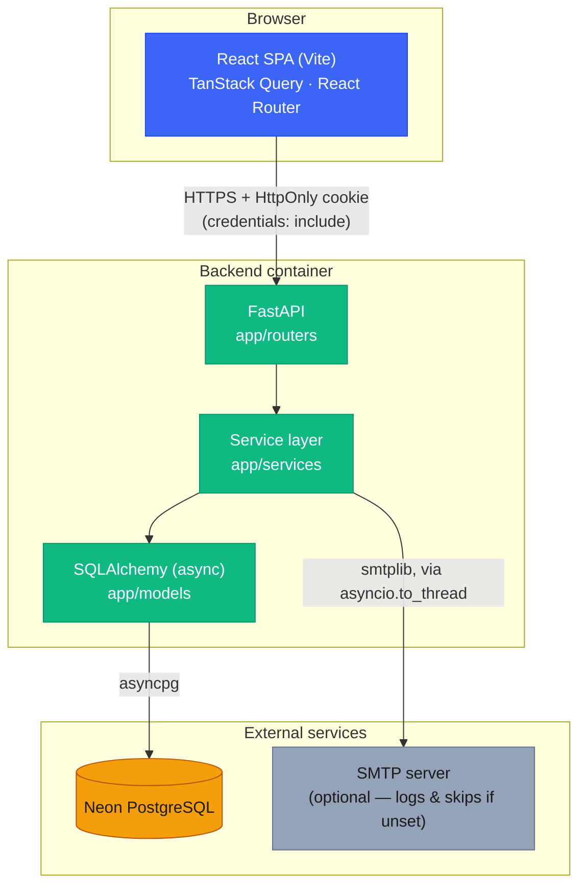
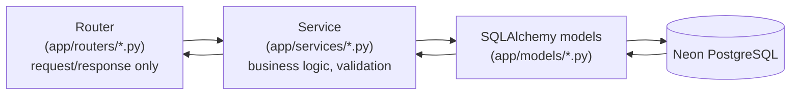
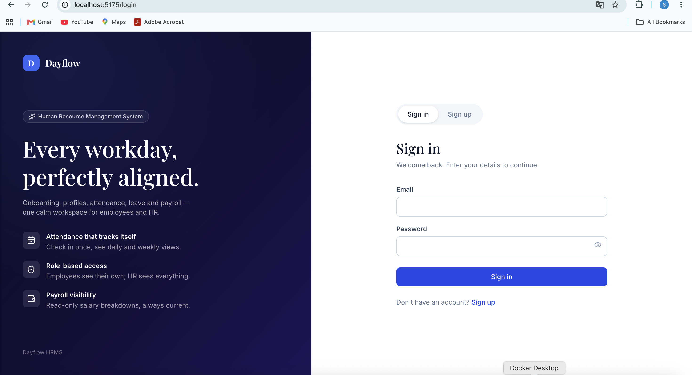

# Dayflow — HRMS

*Every workday, perfectly aligned.*

Dayflow is a full-stack Human Resource Management System: authentication,
employee profiles, attendance, leave management and approval, payroll
visibility, in-app + email notifications, and analytics — for both
employees and HR/Admin.

- **Backend**: [`backend/`](backend/) — FastAPI + SQLAlchemy (async) + PostgreSQL (Neon)
- **Frontend**: [`frontend/`](frontend/) — React + Vite + TypeScript + Tailwind

This is the single source of documentation for the whole project — both
folders' setup, API, schema, and testing details live here.

## Contents

- [System architecture](#system-architecture)
- [Request flow](#request-flow)
- [Features](#features)
- [Tech stack](#tech-stack)
- [Screenshots](#screenshots)
- [Environment variables](#environment-variables)
- [Local setup](#local-setup)
- [Authentication](#authentication--httponly-cookie)
- [Database schema](#database-schema)
- [Full API list](#full-api-list)
- [Performance](#performance)
- [Testing](#testing)
- [MVP limitations](#mvp-limitations)
- [Deployment](#deployment)
- [Repository structure](#repository-structure)

## System architecture



Both services also run together via the root [`docker-compose.yml`](docker-compose.yml)
for local development — no database container, since both connect straight
to the same Neon Postgres instance.

## Request flow

Every backend request follows the same thin-router → service → ORM path;
business logic never lives in a route handler.



Auth is HttpOnly-cookie based: `POST /api/auth/login` (and `POST
/api/auth/signup`) set `access_token` as an `HttpOnly` cookie; the browser
sends it automatically on every subsequent request; `get_current_user`
reads it server-side. The frontend never reads or stores the token itself
— see [Authentication](#authentication--httponly-cookie) below.

```mermaid
sequenceDiagram
    participant Browser
    participant API as FastAPI
    participant DB as Neon Postgres

    Browser->>API: POST /api/auth/login {email, password}
    API->>DB: verify credentials
    DB-->>API: user row
    API-->>Browser: Set-Cookie: access_token=<jwt>; HttpOnly<br/>body: user only, no token
    Note over Browser: Cookie stored, sent automatically from here on

    Browser->>API: GET /api/employees/me (cookie sent automatically)
    API->>API: get_current_user() reads cookie, verifies JWT
    API->>DB: fetch employee
    DB-->>API: employee row
    API-->>Browser: employee JSON
```

## Features

- **Auth**: signup (EMPLOYEE/HR only — ADMIN is seed-only) with immediate
  sign-in (no separate verification step blocking access), login/logout via
  HttpOnly cookie, email-based password reset (1-hour token), role-based
  access (`EMPLOYEE` / `HR` / `ADMIN`), basic rate limiting on
  login/signup/forgot-password
- **Employee profile**: self-service view/edit (phone, address, photo
  upload); HR/Admin manage full records (name, job title, department, status)
- **Attendance**: check-in/check-out, daily/weekly views, HR/Admin
  org-wide view with date filtering
- **Leave management**: apply, track status, HR/Admin approve/reject with
  a comment; overlap detection
- **Payroll**: HR/Admin sets the salary structure, employees get read-only
  visibility — no automatic calculation, by design
- **Notifications**: in-app + email on leave submit/approve/reject and
  payroll updates, unread badge, mark-as-read
- **Analytics**: attendance/leave/payroll summaries and trends, scoped to
  the employee for self-service, org-wide for HR/Admin

## Tech stack

| Layer | Stack |
|---|---|
| Frontend | React, Vite, TypeScript, Tailwind CSS, TanStack Query, React Router, Recharts |
| Backend | FastAPI, SQLAlchemy 2.x (async), Pydantic v2, Alembic |
| Database | PostgreSQL, hosted on [Neon](https://neon.tech) |
| Auth | JWT in an HttpOnly cookie, Argon2 password hashing |
| Email | stdlib `smtplib` (no extra dependency; skips gracefully if unconfigured) |
| Dev/deploy | Docker Compose (backend + frontend, no DB container) |

## Screenshots

**Login**



**Employee dashboard**


More views can be added the same way — save an image into
[`docs/screenshots/`](docs/screenshots/) and reference it here.

## Environment variables

**Backend** (`backend/.env`, gitignored — `backend/.env.example` holds placeholders):

| var | purpose |
|---|---|
| `DATABASE_URL` | Neon Postgres connection string, `postgresql+asyncpg://...` |
| `TEST_DATABASE_URL` | **Separate** database used only by `pytest` — never the dev DB |
| `JWT_SECRET_KEY` | HMAC signing key, ≥32 bytes |
| `JWT_ALGORITHM` | default `HS256` |
| `ACCESS_TOKEN_EXPIRE_MINUTES` | default `60` — also the cookie's `max-age` |
| `CORS_ORIGINS` | comma-separated allowed origins, no `*` with credentials |
| `FRONTEND_URL` | base URL of the deployed frontend; used to build the link inside password-reset emails (default `http://localhost:5175`) |
| `BACKEND_URL` | this API's own public base URL; used to build absolute links to files it serves itself, e.g. uploaded profile pictures (default `http://localhost:8000`) — a relative path would resolve against the frontend's origin in the browser, not the API's |
| `COOKIE_SECURE` | default `false`; set `true` behind HTTPS in production |
| `COOKIE_SAMESITE` | default `lax`; set `none` cross-domain in production (requires `COOKIE_SECURE=true`) |
| `SMTP_HOST` / `SMTP_PORT` / `SMTP_USERNAME` / `SMTP_PASSWORD` / `SMTP_FROM_EMAIL` | optional — if `SMTP_HOST` is unset, email sending is skipped and logged instead, so the app works fully without SMTP configured |

**Frontend** (`frontend/.env`, gitignored — `frontend/.env.example` holds placeholders):

| var | purpose |
|---|---|
| `VITE_API_URL` | the backend's base URL, e.g. `http://localhost:8000` or the Render URL in production. Baked in at build time — redeploy after changing it. |

## Local setup

```bash
git clone <this repo>
cd Dayflow

cp backend/.env.example backend/.env    # fill in DATABASE_URL, TEST_DATABASE_URL, JWT_SECRET_KEY
cp frontend/.env.example frontend/.env  # VITE_API_URL=http://localhost:8000

docker compose up --build
```

- Frontend: http://localhost:5175
- Backend + Swagger docs: http://localhost:8000/docs

### Neon database setup

1. Create a Neon project; use its pooled connection string for `DATABASE_URL`.
2. Create a second database in the **same** project for tests:
   ```sql
   CREATE DATABASE dayflow_test;
   ```
   Point `TEST_DATABASE_URL` at it.
3. Apply migrations to both — `alembic upgrade head` only touches
   `DATABASE_URL`, so a new migration needs both commands or the test
   suite will fail with a confusing `UndefinedColumnError`:
   ```bash
   cd backend
   alembic upgrade head
   ALEMBIC_DATABASE_URL="$TEST_DATABASE_URL" alembic upgrade head
   ```

If running outside Docker: `python3 -m venv .venv && source .venv/bin/activate && pip install -r requirements.txt`, then `uvicorn app.main:app --reload`.

### Seed data

```bash
cd backend && source .venv/bin/activate && python -m scripts.seed
```

| email | role | password |
|---|---|---|
| admin@dayflow.dev | ADMIN | AdminPass123! |
| hr@dayflow.dev | HR | HrPass123! |
| employee1@dayflow.dev | EMPLOYEE | EmpPass123! |
| employee2@dayflow.dev | EMPLOYEE | EmpPass123! |
| employee3@dayflow.dev | EMPLOYEE | EmpPass123! |

Idempotent — safe to re-run. This is the **only** way to create an ADMIN
account; public signup rejects `role=ADMIN`.

If you add a frontend dependency (`npm install <pkg>` on the host), a plain
`docker compose build frontend` is **not enough** — Compose reuses the
anonymous `node_modules` volume across recreates:
```bash
docker compose up -d --force-recreate --renew-anon-volumes frontend
```

## Authentication — HttpOnly cookie

```
POST /api/auth/login (or /api/auth/signup)
   ↓ validate credentials / create account
   ↓ generate JWT
   ↓ Set-Cookie: access_token=<jwt>; HttpOnly; SameSite=Lax; Path=/; Max-Age=3600
   ↓ response body: the user only — no token in JSON, ever
Browser stores the cookie; sends it automatically on every same-origin request
FastAPI reads request.cookies["access_token"] in get_current_user
```

- `POST /api/auth/signup` — `role` restricted to `EMPLOYEE`/`HR`; accepts an
  optional `name` field. **Sets the auth cookie**, same as login — a new
  account is signed in immediately, no separate step blocking access.
- `POST /api/auth/login` — sets the cookie, returns the user.
- `GET /api/auth/me` — current user from the cookie.
- `POST /api/auth/logout` — clears the cookie (`Max-Age=0`).
- `POST /api/auth/forgot-password` — `{email}`, always returns the same
  message regardless of whether the email exists (no account enumeration).
  If it exists, emails a reset link (`{FRONTEND_URL}/reset-password?token=...`),
  token expires in 1 hour.
- `POST /api/auth/reset-password` — `{token, newPassword}`, 400 on an
  invalid/expired token, clears the token on success.

`login`, `signup`, and `forgot-password` are behind a basic in-memory rate
limiter (5–10 requests/minute per IP+path) — process-local, not shared
across multiple instances.

CORS is `allow_credentials=True` with an explicit origin list (never `"*"`
with credentials) — required for cookies to work cross-origin.

## Database schema

```
User (users)
 └── Employee (employees)     1:1, via employees.user_id → users.id
      ├── Attendance          attendance.employee_id → employees.id
      ├── Leave (leaves)      leaves.employee_id → employees.id, leaves.reviewer_id → users.id
      ├── Payroll             payroll.employee_id → employees.id (unique), payroll.updated_by → users.id
      └── Notification        notifications.user_id → users.id (auth-level, not employee-level)
```

**`users`** — authentication only.

| column | type | notes |
|---|---|---|
| id | UUID, PK | |
| employee_id | string, unique | e.g. `EMP001`; same column for every role, including HR/Admin |
| email | string, unique | |
| password_hash | string | Argon2, never returned by the API |
| role | enum(`EMPLOYEE`,`HR`,`ADMIN`) | |
| is_verified | bool | reserved; no verification flow is wired up |
| is_active | bool | drives the employee-facing `status: "ACTIVE"/"INACTIVE"` |
| verification_token | string, nullable | reserved, unused |
| password_reset_token | string, nullable, unique | set by `POST /api/auth/forgot-password`, cleared on use |
| password_reset_token_expires_at | timestamptz, nullable | 1 hour from issuance |
| created_at / updated_at | timestamptz | |

**`employees`** — profile data, no auth material.

| column | type | notes |
|---|---|---|
| id | UUID, PK | internal only — never used as an API path parameter |
| user_id | UUID, FK → users.id, unique | 1:1 with users |
| employee_id | string, unique | the human-readable code; this is what `{employee_id}` path params mean everywhere |
| first_name / last_name | string, nullable | combined into `name` in API responses |
| phone / address / profile_picture | string, nullable | employee-editable; `profile_picture` is a URL set via the upload endpoint |
| job_title / department | string, nullable | HR/Admin-editable only |
| joining_date | date, nullable | HR/Admin-editable only |
| documents | JSONB, default `[]` | array of objects, e.g. `{"name": ..., "url": ...}` — no dedicated table |
| created_at / updated_at | timestamptz | |

Every `{employee_id}` path parameter across `/api/employees`,
`/api/attendance`, and `/api/payroll` is the human-readable
`employees.employee_id` code (e.g. `EMP001`), not the internal UUID.

**`attendance`**

| column | type | notes |
|---|---|---|
| id | UUID, PK | |
| employee_id | UUID, FK → employees.id, indexed | |
| date | date | |
| check_in / check_out | timestamptz, nullable | `check_out` null until checkout |
| status | enum(`PRESENT`,`ABSENT`,`HALF_DAY`,`LEAVE`) | set to `PRESENT` on check-in; no automatic attendance-policy engine |
| created_at / updated_at | timestamptz | |

**`leaves`**

| column | type | notes |
|---|---|---|
| id | UUID, PK | |
| employee_id | UUID, FK → employees.id, indexed | |
| leave_type | enum(`PAID`,`SICK`,`UNPAID`) | |
| start_date / end_date | date | `end_date >= start_date` enforced by the request schema |
| remarks | string, nullable | |
| status | enum(`PENDING`,`APPROVED`,`REJECTED`), indexed | only a `PENDING` leave can be approved/rejected |
| reviewer_id | UUID, FK → users.id, nullable | set on approve/reject |
| review_comment | string, nullable | |
| reviewed_at | timestamptz, nullable | |
| created_at / updated_at | timestamptz | |

A new request is rejected (409) if its date range overlaps any of that
employee's existing `PENDING`/`APPROVED` leaves. No leave-balance tracking.

**`payroll`**

| column | type | notes |
|---|---|---|
| id | UUID, PK | |
| employee_id | UUID, FK → employees.id, unique | one payroll row per employee |
| basic_salary / allowances / deductions / gross_salary / net_salary | numeric(12,2) in DB, `float` on the wire | independently HR/Admin-settable — no automatic calculation |
| updated_by | UUID, FK → users.id, nullable | last HR/Admin who wrote to this row |
| created_at / updated_at | timestamptz | |

`PATCH /api/payroll/{employee_id}` upserts. Money fields are `float` in
the API schema, not `Decimal` — Pydantic serializes `Decimal` to a JSON
string by default, which would silently violate the frontend's `number`
type contract.

**`notifications`**

| column | type | notes |
|---|---|---|
| id | UUID, PK | |
| user_id | UUID, FK → users.id, indexed | not employee-scoped — HR/Admin get these too |
| type | enum(`LEAVE_SUBMITTED`,`LEAVE_APPROVED`,`LEAVE_REJECTED`,`PAYROLL_UPDATED`,`ATTENDANCE_ALERT`,`PROFILE_UPDATED`,`SYSTEM`) | `ATTENDANCE_ALERT`/`PROFILE_UPDATED`/`SYSTEM` exist in the enum but nothing currently emits them |
| title / message | string | |
| is_read | bool, default false | |
| created_at | timestamptz | |

**Indexes/constraints**: `users.email`/`users.employee_id`/`employees.user_id`/`employees.employee_id`/`payroll.employee_id` unique · `attendance(employee_id, date)` unique · `attendance.employee_id`/`leaves.employee_id`/`leaves.status`/`notifications.user_id` indexed.

## Full API list

```
POST   /api/auth/signup
POST   /api/auth/login
GET    /api/auth/me
POST   /api/auth/logout
POST   /api/auth/forgot-password
POST   /api/auth/reset-password

GET    /api/employees/me
PATCH  /api/employees/me
PATCH  /api/employees/me/profile-picture
GET    /api/employees
GET    /api/employees/{employee_id}
PATCH  /api/employees/{employee_id}

POST   /api/attendance/check-in
POST   /api/attendance/check-out
GET    /api/attendance/me
GET    /api/attendance
GET    /api/attendance/{employee_id}

POST   /api/leaves
GET    /api/leaves/me
GET    /api/leaves
GET    /api/leaves/{leave_id}
PATCH  /api/leaves/{leave_id}/approve
PATCH  /api/leaves/{leave_id}/reject

GET    /api/payroll/me
GET    /api/payroll/{employee_id}
PATCH  /api/payroll/{employee_id}

GET    /api/notifications
GET    /api/notifications/unread-count
PATCH  /api/notifications/{notification_id}/read
PATCH  /api/notifications/read-all

GET    /api/analytics/me
GET    /api/analytics/admin
```

**Role/permission matrix**: `get_current_user` (any authenticated, active
user) gates `/auth/*`, `/employees/me`, `/attendance/{check-in,check-out,me}`,
`/leaves` (create/me/detail), `/payroll/me`, `/notifications/*`,
`/analytics/me`. `require_hr_or_admin` gates everything org-wide: employee
list/detail/update, attendance list/detail, leave list/approve/reject,
payroll detail/update, `/analytics/admin`. Role is always read from the
JWT/DB, never trusted from the request body.

## Performance

The app's engine (`backend/app/db/database.py`) uses a real connection pool
(`pool_size=5, max_overflow=10, pool_recycle=300`) — the running process
has one long-lived event loop for its whole lifetime, so pooling is safe
and correct. Deliberately no `pool_pre_ping`: it would add a guaranteed
extra round trip to Neon on every request just to guard against a
staleness window `pool_recycle` already closes.

This mattered in practice: before pooling, every request paid a fresh
TCP+TLS+Postgres-auth handshake to Neon from scratch (measured 5–7s on a
cold connection). With pooling, warm request latency dropped to ~0.75s,
measured directly against a running container — the remainder is real Neon
round-trip time (~250ms per network hop from this deployment's location to
Neon's `us-east-2` region), not app overhead. If most traffic comes from
far outside `us-east-2`, creating the Neon project in a closer AWS region
would cut this further.

## Testing

```bash
cd backend && pytest
```

Runs against `TEST_DATABASE_URL` via a FastAPI dependency override, never
the dev database. 57 tests — signup/login/logout/cookie behavior, employee
profile access control, attendance check-in/out edge cases, leave apply/
overlap/approve/reject, payroll access control, notification scoping,
analytics access control and calculations.

Test run time is long (~40 min) — this is a **test-only** cost, not a
regression from the pooling fix above: the test engine deliberately uses
`NullPool` (a fresh connection per request) because pytest-asyncio gives
each test its own event loop, and asyncpg connections can't cross event
loops (see `backend/tests/conftest.py`). If a run appears to hang, check
`pg_stat_activity` for a stray `idle in transaction` connection before
assuming a real bug:
```sql
SELECT pid, state, now() - query_start AS duration, query
FROM pg_stat_activity WHERE state = 'idle in transaction';
```
`SELECT pg_terminate_backend(<pid>)` clears it.

Tests never send real email — `conftest.py` patches `smtplib.SMTP` for the
whole session, since leave/payroll flows send real notification emails and
test fixtures use non-existent `@example.com` addresses.

## MVP limitations

- Email verification (`is_verified`/`verification_token`) has DB columns
  reserved but no flow wired up — signup grants full access immediately.
- No token revocation/blocklist — logout is a cookie clear, not
  server-side invalidation of the JWT itself.
- Uploaded profile pictures are stored on the backend's local disk — fine
  for a single-instance deployment, but **not persistent** on hosts with an
  ephemeral filesystem (e.g. Render's free tier wipes local disk on every
  deploy/restart). Durable storage would mean wiring up S3/Cloudinary or
  similar.
- No attendance-policy engine, no leave-balance tracking, tax calculation,
  or payslip generation.
- Payroll's `gross_salary`/`net_salary` are stored values HR/Admin enters
  directly, never computed — by design.
- `NotificationType.ATTENDANCE_ALERT` and `PROFILE_UPDATED` exist in the
  enum but nothing currently triggers them.

## Deployment

Backend and frontend deploy as two independent services — **backend on
Render**, **frontend on Vercel** — both from this same repo, each pointed
at its own subfolder.

### Backend → Render

Render reads [`render.yaml`](render.yaml) (a Blueprint) if you create the
service via **New → Blueprint** and point it at this repo; it already
declares `rootDir: backend`, builds from `backend/Dockerfile`, and checks
`/health`.

Set these in the Render dashboard's Environment tab — the blueprint lists
them but deliberately leaves the values blank (`sync: false`) since
they're secrets or deployment-specific:

| var | value |
|---|---|
| `DATABASE_URL` | your Neon connection string |
| `JWT_SECRET_KEY` | a real random secret, ≥32 bytes |
| `CORS_ORIGINS` | your Vercel frontend URL, e.g. `https://dayflow.vercel.app` |
| `FRONTEND_URL` | same Vercel frontend URL — used to build links in emails |
| `BACKEND_URL` | this service's own public URL, e.g. `https://dayflow-py0h.onrender.com` — used to build links to files it serves, like uploaded profile pictures |
| `SMTP_HOST` / `SMTP_USERNAME` / `SMTP_PASSWORD` / `SMTP_FROM_EMAIL` | optional — omit to leave email sending skipped/logged |

`COOKIE_SECURE=true` and `COOKIE_SAMESITE=none` are already set as defaults
in the blueprint — required because the frontend and backend are different
domains in production.

The container runs `alembic upgrade head` on every deploy before starting
the server. If you ever apply a migration locally against the same
database Render uses, push that migration file before Render redeploys —
otherwise the deploy fails with `Can't locate revision identified by
'<hash>'` (Alembic finds the DB already stamped past what the deployed
code's migration folder knows about).

### Frontend → Vercel

Create a Vercel project from this repo with **Root Directory set to
`frontend`**. Vercel auto-detects the Vite build; [`frontend/vercel.json`](frontend/vercel.json)
adds a rewrite so client-side routes (React Router) don't 404 on a direct
load or page refresh.

Set in the Vercel dashboard's Environment Variables:

| var | value |
|---|---|
| `VITE_API_URL` | your Render backend URL, e.g. `https://dayflow-backend.onrender.com` |

Vite bakes `VITE_API_URL` into the build at build time, so re-deploy after
changing it.

## Repository structure

```
Dayflow/
├── README.md                this file — the only README in the project
├── docker-compose.yml        runs backend + frontend together for local dev
├── render.yaml                Render Blueprint for the backend service
├── docs/
│   └── screenshots/           app screenshots
├── backend/                   FastAPI + SQLAlchemy + Neon Postgres
│   ├── app/
│   │   ├── main.py             FastAPI app, CORS, static file mount, router registration
│   │   ├── core/                config, security, JWT, rate limiting, role-guard dependencies
│   │   ├── db/                   async engine (pooled), session factory
│   │   ├── models/                SQLAlchemy ORM models
│   │   ├── schemas/                Pydantic request/response models (CamelModel-based)
│   │   ├── routers/                 FastAPI routers (thin — request/response only)
│   │   └── services/                 business logic, notification_service.py, email_service.py
│   ├── alembic/                 migrations
│   ├── tests/                    pytest + httpx tests (run against an isolated DB)
│   ├── static/uploads/            uploaded profile pictures (gitignored contents)
│   └── scripts/seed.py            seeds 1 ADMIN, 1 HR, 3 EMPLOYEE accounts
└── frontend/                  React + Vite + TypeScript
    ├── vercel.json             SPA rewrite for client-side routing
    └── src/                     pages, components, hooks, api client
```
